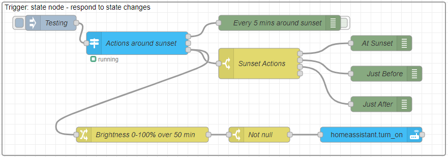

# Trigger: state

The **Trigger: state** node is very similar to the _Events: state_ node. It will trigger when a given entity state changes, but unlike the _Events: state_, the _Trigger: state_ node has the opportunity to add conditions using UI fields to construct complex tests. This removes much of the need to manage conditional tests using JSONata.

JSONata _can_ be used in several places within this node. However real practical use is quite limited. Although the Trigger node has extensive conditional testing included as UI setting, it does not have access to the $entity() or $entities() function in the conditions. The example given here is rather simplistic and contrived to demonstrate that JSONata can be used, rather than focusing on a genuinue or realistic use-case.



**Example:** Respond every five minutes during the hour before and hour after sunset.

@[code](@examples/cookbook/jsonata-examples/trigger-state.json)

Sunrise and sunset times are often critical to running automations, and Home Assistant has inbuilt entities that provide the next dawn, sunrise, dusk, and sunset times. In order to be able to respond to _multiple_ events during the period both before and after sunset, it is necessary to trigger at a more regular interval, not just on the sun-events, and then to test for required times or periods before and after sunset.

The _Trigger: state_ node can be set to use the `sensor.time_utc` entity as the subject of the node. This sensor holds UTC time as "hh:mm", and will change every minute, thus triggering a state change at regular 60 second intervals. We can add conditions to test the time against an _expected_ period around sunset, and to generate a _customised output_ that includes given periods or times before or after sunset. Combined with a _Switch_ node this permits multiple tests and multiple automation events to be actioned.

### Using JSONata to set a _condition value_

Here JSONata is used to generate an array of times of interest. When the trigger entity state, UTC time "hh:mm", is included in the calculated array, the condition is met and a message will be output.

Since JSONata does not have access to the $entities() function in this particular UI field, the code here is used to generate a period of interest based on hard-coded sunrise and sunset times according to the current month. This is not ideal, but does demonstrate how JSONata can be used to easily generate and manipulate various JSON structures.

```
(
/* UTC sunrise & sunset to 5 mins, month average (London UK) */
/* Jan-Dec, Feb-Nov, Mar-Oct, Apr-Sep, May-Aug, Jun-Jly      */
    $times:=[["07:55", "16:20"],
             ["07:15", "16:45"],
             ["06:00", "17:35"],
             ["05:15", "18:30"],
             ["04:30", "19:30"],
             ["04:05", "20:05"]];

/* get this month (Jan=0), lookup sun-times table, return sun rise-set for this month */
    $mtable:=[0..11].$min([$, $abs($-11)]);
    $mindex:=$now('[M]').$number()-1;

/* get sunset and build array of condition test-times around this */
    $sunset:=($times[$mtable[$mindex]])[1];
    $h:=$number($substringBefore($sunset, ":"));
    $m:=$number($substringAfter($sunset, ":"));

/* for span period mins, generate array of times and select every nth */
    $span:=60;
    $nth:=5;

    $t:=$h*60+$m-$span;
    ([$t..$t+$span*2])#$i.(
        $h:=$floor($/60);
        $m:=$%60;
        $i%$nth=0 ? $formatInteger($h,'99') & ":" & $formatInteger($m, '99');
    )
)
```

This code uses the current month to lookup a given sunset time, and then to generate an array of times either side of expected sunset, using a given span in minutes, and then picking out every five minutes only.

_The figures provided are examples, based on UTC times (DST ignored) for location London, UK and estimate an average sunrise and sunset time for each calendar month. Since sun events can move by up to one hour from start to end of a month, a span of at least 30 minutes is required to successfully include events across the entire month._

### Using JSONata to create a _custom message_

The output properties on successful trigger include a default message and a default payload, which includes the basic event details for the trigger entity. It is possible to set the output as a _customised payload_, which replaces msg.payload with specific output, or as a _customised message_, which replaces the entire message with a generated object.

```
(
    $sunset:=$entities('sensor.sun_next_setting').state;
    $togo:= ($toMillis($sunset)-$millis())/60000~>$floor();
    $toset:= $togo < 180 ? $togo : $togo-1440;
    $x:= $toset-25;
    $pc:= $x<0 and $x>-55 ? $min([$abs($x)*2, 100]) : null;

    {"topic": "Minutes to Sunset",
     "payload": $toset,
     "time": $entities('sensor.time').state,
     "sunset": $sunset,
     "percent": $pc
    }
)
```

The `$entities()` function is available in JSONata in the output properties UI field, which means that both current time and sunset time can be obtained and compared. This allows some simple JSONata code to generate a complete message object, including _msg.topic_ and _msg.payload_ with the exact minutes to the next sunset correctly calculated.

For automation, all that is required is a following _Switch_ node set to route on a message property, for example _msg.payload_ as minutes to next sunset between 0 and 4 (based on a five minute trigger interval) so as to be able to run an automation just as sunset is about to take place (with a five minute discrimination).

As a further example, the JSONata output calculates a percentage value going from 0 to 100 over the period 25 minutes before to 25 minutes after sunset, with the percentage value set to 'null' outside this time. The _Change_ node following also uses JSONata to create the entire _Service Call_ node input settings, to turn on a group of lights in an timed-incremental fashion.

**Also see:**

- [JSONata guide](../../guide/jsonata/)
- [JSONata primer](../../guide/jsonata/jsonata-primer.md)
