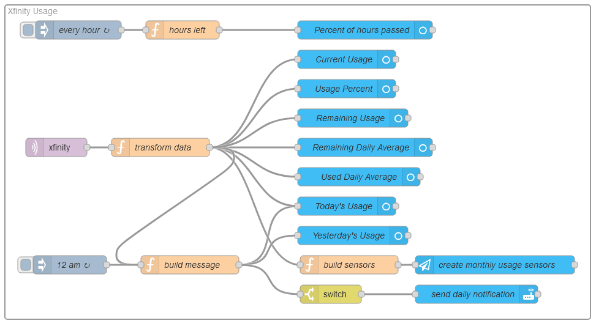
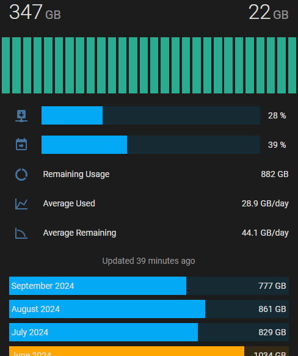

# Xfinity Usage Monitoring

## Description

This project takes raw internet usage data from Xfinity, sourced from the [hassio-xfinity-usage](https://github.com/thor0215/hassio-xfinity-usage/), and transforms it into sensors within Home Assistant. It tracks current usage, remaining data, and averages, displaying daily usage for the current month, along with a historical view of the last 12 months of data. The dashboard was inspired by [this gist](https://gist.github.com/ronaldheft/cb6fa83ea3873545c411da03b42cd2d9) and further modified to suit specific needs.

Some of the key sensors this flow creates are:

- **Current Usage**
- **Remaining Usage**
- **Average Usage** (daily and monthly)
- **Graphical representation of daily usage**
- **Daily usage notifications**

Here's an improved version of the requirements list with some additional context for clarity:

### Requirements

- **Home Assistant** - [GitHub Repository](https://github.com/home-assistant/core/)
- **Node-RED** - [GitHub Repository](https://github.com/node-red/node-red)
- **node-red-contrib-home-assistant-websocket** - [GitHub Repository](https://github.com/zachowj/node-red-contrib-home-assistant-websocket)
- **Node-RED Companion Custom Component** - [GitHub Repository](https://github.com/zachowj/hass-node-red)

This flow requires Node-RED to be configured with a [context store](https://nodered.org/docs/user-guide/context#saving-context-data-to-the-file-system) named "file" to persist data to the file system. This is essential for storing the starting amount of the day’s usage. If desired, this functionality could be adapted to save the data as a sensor in Home Assistant instead.

Add the following configuration to your `settings.js` file to enable file-based storage:

```json title="settings.js"
contextStorage: {
    default: {
        module: "memory",  // Volatile memory storage
    },
    file: {
        module: "localfilesystem"  // Persistent storage in the file system
    }
},
```

This setup ensures that data, such as daily internet usage, is retained across Node-RED restarts. Alternatively, you can adjust the flow to save the daily starting value directly to a Home Assistant sensor, if desired.

### Flow Overview



@[code](@examples/cookbook/xfinity_usage.json)

### Items to Update After Importing the Flow:

- **Home Assistant Nodes**: Ensure all Home Assistant nodes are configured with the correct server instance.
- **MQTT Node**: Select the appropriate MQTT broker for your setup.
- **Notification Action Node**: Update the "Send Daily Notification" node to target the correct device notifications.

These adjustments will ensure that the flow works correctly within your specific environment.

## Frontend Dashboard Setup

The Home Assistant frontend is designed to give you a clear, organized overview of your internet usage. The dashboard consists of eight distinct sections:



<details>
<summary>Click to view the YAML code for the dashboard</summary>

```yaml
type: custom:vertical-stack-in-card
title: Xfinity Usage
cards:
  - type: custom:mini-graph-card
    icon: mdi:download-network
    entities:
      - entity: sensor.xfinity_current_usage
        name: Xfinity Data
        show_graph: false
        aggregate_func: last
      - entity: sensor.xfinity_today_s_usage
        name: Xfinity Data
        show_graph: true
        show_state: true
        aggregate_func: last
    hours_to_show: 672
    group_by: date
    font_size_header: 14
    font_size: 100
    line_width: 3
    group: false
    lower_bound: 0
    animate: true
    smoothing: false
    color_thresholds:
      - value: 0
        color: rgba(42, 187, 155, 0.9)
      - value: 30
        color: var(--label-badge-yellow)
      - value: 40
        color: "#b93829"
    show:
      points: false
      labels: false
      labels_secondary: false
      legend: false
      graph: bar
      icon: false
      name: false
    tap_action: none
  - type: entities
    show_header_toggle: false
    entities:
      - type: custom:bar-card
        name: Xfinity
        icon: mdi:download-network
        entity: sensor.xfinity_usage_percent
        entity_row: true
        max: 100
        unit_of_measurement: "%"
        positions:
          name: "off"
          indicator: "off"
          value: outside
        height: 30px
        card_mod:
          style: >-
            ha-card { border-width: 0 } bar-card-background { margin-right: 13px
            !important; margin-top: 5px !important; }
      - type: custom:bar-card
        name: Month Percent
        icon: mdi:calendar-arrow-right
        entity: sensor.percent_of_hours_passed
        entity_row: true
        max: 100
        positions:
          name: "off"
          indicator: "off"
          value: outside
        height: 30px
        card_mod:
          style: >-
            ha-card { border-width: 0; width: 100%; } bar-card-background {
            margin-right: 13px !important; margin-top: 5px !important; }
      - name: Remaining Usage
        entity: sensor.xfinity_remaining_usage
        icon: mdi:chart-donut
      - name: Average Used
        entity: sensor.xfinity_average_gb_used
      - name: Average Remaining
        entity: sensor.xfinity_average_gb_remaining
  - type: markdown
    card_mod:
      style: |
        ha-card { border-width: 0; }
        ha-markdown.no-header { padding: 0 !important; text-align: center; }
        ha-markdown { color: var(--secondary-text-color); }
    content: >-
      Updated {{relative_time(states.sensor.xfinity_usage_percent.last_reported)
      }} ago
  - type: entities
    show_header_toggle: false
    entities:
      - type: custom:bar-card
        entity: sensor.xfinity_month_usage_0
        unit_of_measurement: GB
        entity_row: true
        max: 1229
        severity:
          - from: 950
            to: 1100
            color: var(--label-badge-yellow)
          - from: 1100
            to: 1229
            color: "#b93829"
        positions:
          icon: "off"
        height: 30px
        tap_action: none
        card_mod:
          style: "ha-card { border-width: 0 }"
      - type: custom:bar-card
        entity: sensor.xfinity_month_usage_1
        unit_of_measurement: GB
        entity_row: true
        max: 1229
        severity:
          - from: 950
            to: 1100
            color: var(--label-badge-yellow)
          - from: 1100
            to: 1229
            color: "#b93829"
        positions:
          icon: "off"
        height: 30px
        tap_action: none
        card_mod:
          style: "ha-card { border-width: 0 }"
      - type: custom:bar-card
        entity: sensor.xfinity_month_usage_2
        unit_of_measurement: GB
        entity_row: true
        max: 1229
        severity:
          - from: 950
            to: 1100
            color: var(--label-badge-yellow)
          - from: 1100
            to: 1229
            color: "#b93829"
        positions:
          icon: "off"
        height: 30px
        tap_action: none
        card_mod:
          style: "ha-card { border-width: 0 }"
      - type: custom:bar-card
        entity: sensor.xfinity_month_usage_3
        unit_of_measurement: GB
        entity_row: true
        max: 1229
        severity:
          - from: 950
            to: 1100
            color: var(--label-badge-yellow)
          - from: 1100
            to: 1229
            color: "#b93829"
        positions:
          icon: "off"
        height: 30px
        tap_action: none
        card_mod:
          style: "ha-card { border-width: 0 }"
      - type: custom:bar-card
        entity: sensor.xfinity_month_usage_4
        unit_of_measurement: GB
        entity_row: true
        max: 1229
        severity:
          - from: 950
            to: 1100
            color: var(--label-badge-yellow)
          - from: 1100
            to: 1229
            color: "#b93829"
        positions:
          icon: "off"
        height: 30px
        tap_action: none
        card_mod:
          style: "ha-card { border-width: 0 }"
      - type: custom:bar-card
        entity: sensor.xfinity_month_usage_5
        unit_of_measurement: GB
        entity_row: true
        max: 1229
        severity:
          - from: 950
            to: 1100
            color: var(--label-badge-yellow)
          - from: 1100
            to: 1229
            color: "#b93829"
        positions:
          icon: "off"
        height: 30px
        tap_action: none
        card_mod:
          style: "ha-card { border-width: 0 }"
      - type: custom:bar-card
        entity: sensor.xfinity_month_usage_6
        unit_of_measurement: GB
        entity_row: true
        max: 1229
        severity:
          - from: 950
            to: 1100
            color: var(--label-badge-yellow)
          - from: 1100
            to: 1229
            color: "#b93829"
        positions:
          icon: "off"
        height: 30px
        tap_action: none
        card_mod:
          style: "ha-card { border-width: 0 }"
      - type: custom:bar-card
        entity: sensor.xfinity_month_usage_7
        unit_of_measurement: GB
        entity_row: true
        max: 1229
        severity:
          - from: 950
            to: 1100
            color: var(--label-badge-yellow)
          - from: 1100
            to: 1229
            color: "#b93829"
        positions:
          icon: "off"
        height: 30px
        tap_action: none
        card_mod:
          style: "ha-card { border-width: 0 }"
      - type: custom:bar-card
        entity: sensor.xfinity_month_usage_8
        unit_of_measurement: GB
        entity_row: true
        max: 1229
        severity:
          - from: 950
            to: 1100
            color: var(--label-badge-yellow)
          - from: 1100
            to: 1229
            color: "#b93829"
        positions:
          icon: "off"
        height: 30px
        tap_action: none
        card_mod:
          style: "ha-card { border-width: 0 }"
      - type: custom:bar-card
        entity: sensor.xfinity_month_usage_9
        unit_of_measurement: GB
        entity_row: true
        max: 1229
        severity:
          - from: 950
            to: 1100
            color: var(--label-badge-yellow)
          - from: 1100
            to: 1229
            color: "#b93829"
        positions:
          icon: "off"
        height: 30px
        tap_action: none
        card_mod:
          style: "ha-card { border-width: 0 }"
      - type: custom:bar-card
        entity: sensor.xfinity_month_usage_10
        unit_of_measurement: GB
        entity_row: true
        max: 1229
        severity:
          - from: 950
            to: 1100
            color: var(--label-badge-yellow)
          - from: 1100
            to: 1229
            color: "#b93829"
        positions:
          icon: "off"
        height: 30px
        tap_action: none
        card_mod:
          style: "ha-card { border-width: 0 }"
```

</details>

### Dashboard Sections:

1. **Top Row**: Shows current monthly and daily usage.
2. **Second Row**: A graph showing daily usage for the current month.
3. **Third Row**: Percentage of total monthly usage consumed.
4. **Fourth Row**: Percentage of hours passed for the current month.
5. **Fifth Row**: Remaining usage for the current month.
6. **Sixth Row**: Average daily usage for the month.
7. **Seventh Row**: Remaining daily usage for the month.
8. **Bottom Rows**: Last 11 months of usage in a historical graph.

### Required Custom Components for the Dashboard

- **Vertical Stack in Card**: [GitHub Repo](https://github.com/ofekashery/vertical-stack-in-card)
- **Mini Graph Card**: [GitHub Repo](https://github.com/kalkih/mini-graph-card)
- **Bar Card**: [GitHub Repo](https://github.com/custom-cards/bar-card)

## Additional Features

You can extend this setup with the following ideas:

1. **Notification for Usage Threshold**: Add a **Switch Node** and **Action Node** to send notifications when usage reaches a specific percentage (e.g., 90% of monthly limit).
2. **Monitor for Data Update**: Use a **Trigger Node** and **Action Node** to alert you if the data hasn’t updated in a specified time frame (e.g., 24 hours).
3. **InfluxDB Integration**: Use a **Change Node** and **InfluxDB Node** to store usage data in a database for long-term tracking and analysis.
